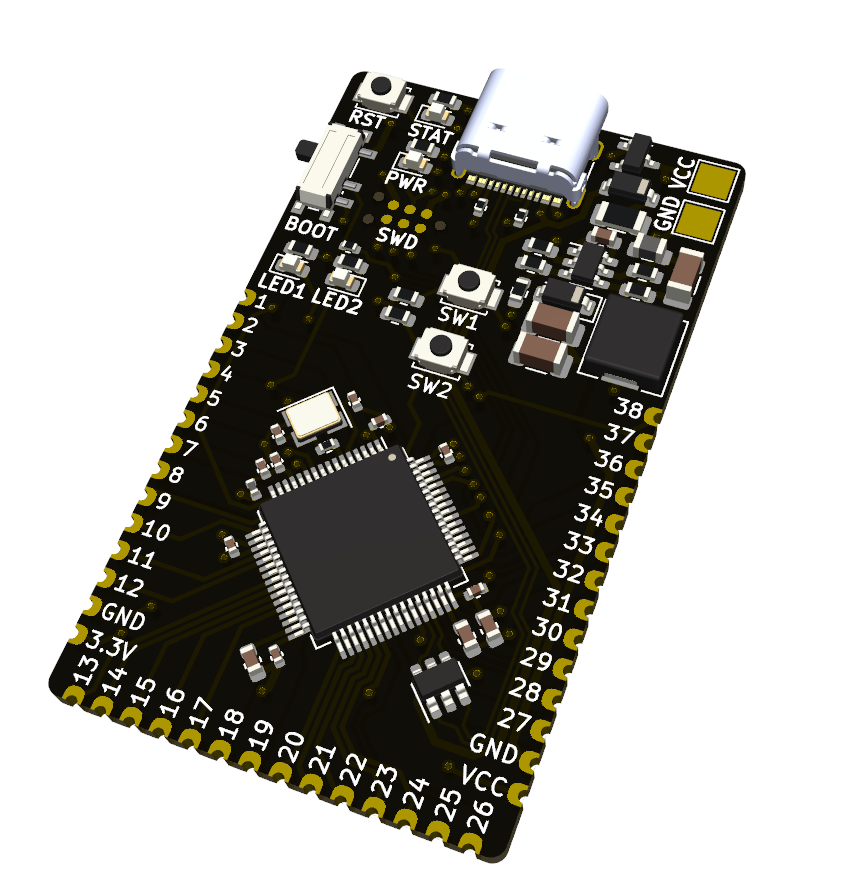
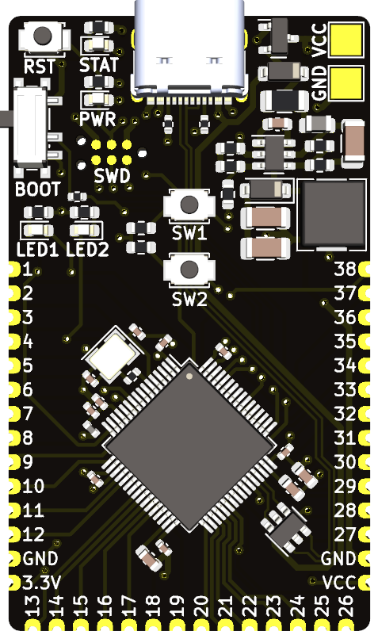
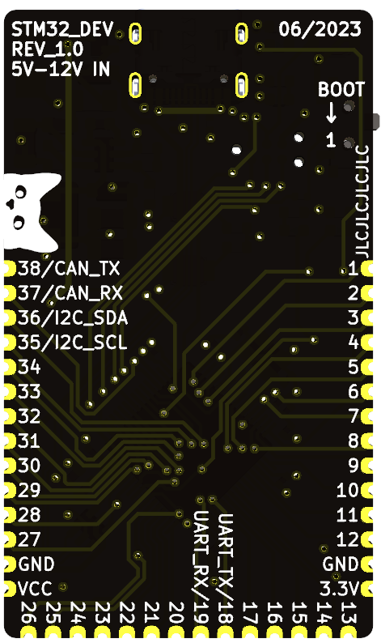
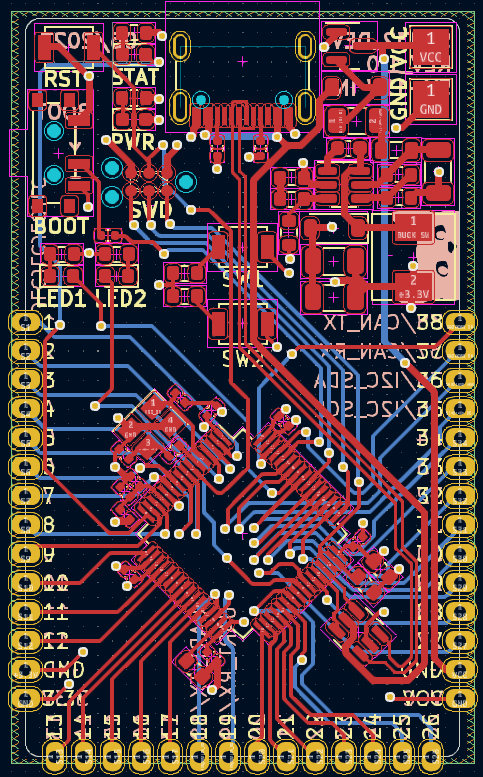
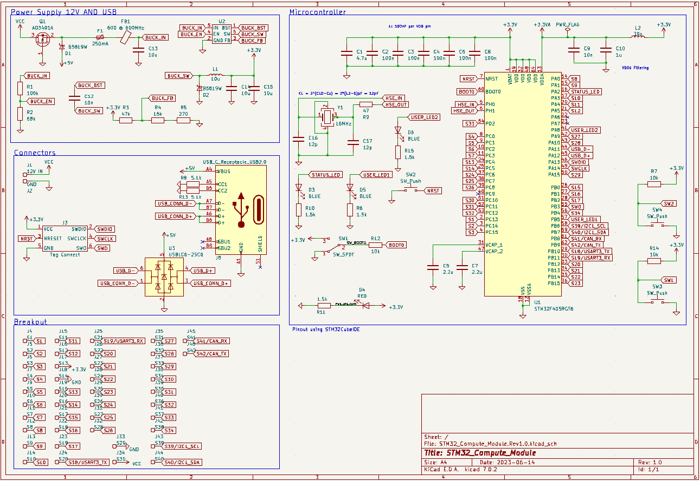

# Custom STM32 Compute Module

## Introduction

In order to wrap my head around using KiCAD I decided to design an STM32 compute module. The goal of this exercise was to familiarise myself with the program enough so that I was comfortable designing PCBs and getting them manufactured for Uni and personal projects. Due to the high cost of manufacturing this board and the possibility of it not working it was never manufactured/tested and was purely a way for me to learn how to use KiCAD.

## Features

- STM32F4 Microcontroller
- Full breakout of GPIO pins
- Voltage Regulator with fuse
- USBC
- SWD tag connector

## Module Overview

In theory this board is capable of being the heart of many different projects as a replacement for the slow Arduino boards.

## Images

### PCB

### Schematic

